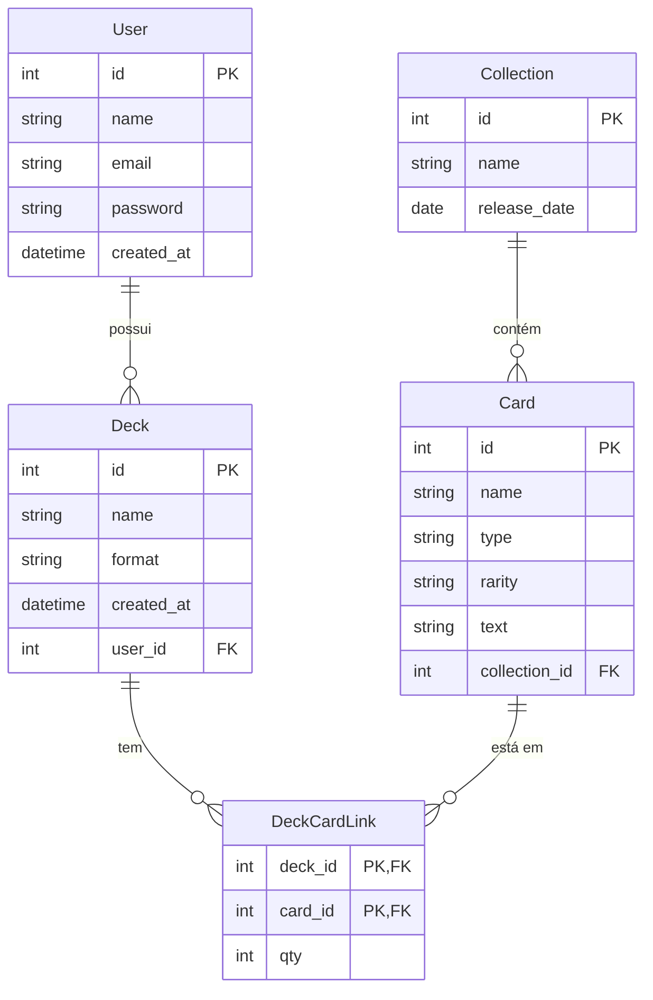

```mermaid
erDiagram
    User {
        int id PK
        string name
        string email
        string password
        datetime created_at
    }

    Deck {
        int id PK
        string name
        string format
        datetime created_at
        int user_id FK
    }

    Card {
        int id PK
        string name
        string type
        string rarity
        string text
        int collection_id FK
    }

    Collection {
        int id PK
        string name
        date release_date
    }

    DeckCardLink {
        int deck_id PK, FK
        int card_id PK, FK
        int qty
    }

    User ||--o{ Deck : "possui"
    Collection ||--o{ Card : "contém"
    Deck ||--o{ DeckCardLink : "tem"
    Card ||--o{ DeckCardLink : "está em"
```
